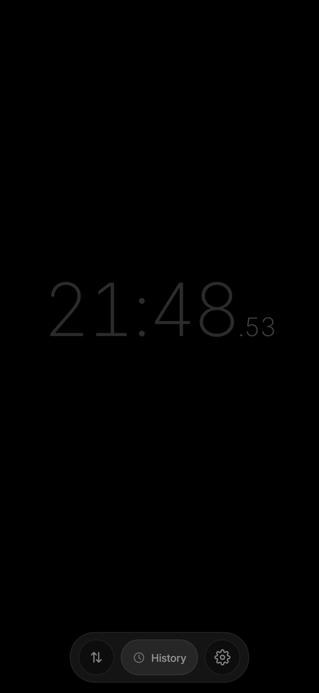
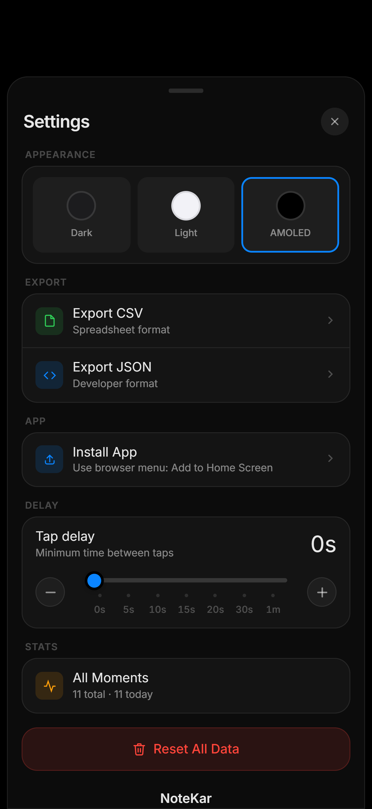

<div align="center">

# 🌐 NoteKar Web PWA

[](https://notekarapp.vercel.app/)
[](https://github.com/dheeraz101/Notekar-Android)
[](https://notekarapp.vercel.app/privacy.html)
[](LICENSE)

### *Sovereign Timestamp Logging in Modern Web Browsers*

**Zero Friction • 1-Tap Glass Logging • IndexedDB Local Storage • 100% Private & Air-Gapped**

<p align="center">
  <a href="https://notekarapp.vercel.app/">
    
  </a>
  &nbsp;&nbsp;
  <a href="https://github.com/dheeraz101/Notekar-Android">
    
  </a>
</p>

</div>

---

> [!IMPORTANT]
> **Companion Web App & Sovereign Architecture**  
> This repository contains the **NoteKar Progressive Web App (PWA)** and product website. It mirrors NoteKar's core timestamp logging experience directly in any modern browser using local IndexedDB storage.
> 
> For the flagship Android experience with Life Audit, The Cost of the Void, Life Ledger Timeline, Sobriety Companion, and local Isar database, visit the **[NoteKar Android Repository](https://github.com/dheeraz101/Notekar-Android)**.

---

## 📸 Web PWA Interface

<div align="center">

| Instant Glass Chronometer | Settings & Local Controls |
| :---: | :---: |
|  |  |
| *One-tap timestamp recording on glass* | *Appearance, delay guard, and 1-tap exports* |

</div>

---

## ✨ Key Capabilities

- **Instant Tap Logging**: One tap logs the exact second with zero input friction.
- **Dual Operating Modes**: Switch between Two-Way (`IN` / `OUT` session intervals) and Single counters.
- **Zero Cloud & Air-Gapped**: All timestamps and notes are stored strictly in client-side **IndexedDB**.
- **Configurable Tap Delay Guard**: Prevent accidental double-taps (0s to 60s cooldown).
- **Data Portability**: 1-tap export to clean CSV and JSON. Your records remain yours.
- **Zero Tracking**: No Google Analytics, no Firebase, no advertising pixels, no mandatory accounts.

---

## 🔒 Privacy & Sovereignty

NoteKar is architected around strict privacy-by-default:

- 🛡️ **[Privacy Policy](https://notekarapp.vercel.app/privacy.html)**: Explains our zero-telemetry, offline-first data model.
- 📜 **[Terms of Service](https://notekarapp.vercel.app/terms.html)**: Open-source terms and usage policies.

---

## 🚀 Running Locally

```bash
# Clone the repository
git clone https://github.com/dheeraz101/Notekar.git
cd Notekar

# Start a local static server
# Option A: Python 3
python -m http.server 8000

# Option B: Node.js
npx http-server -p 8000
```

Open `http://localhost:8000` in any web browser.

---

## ☕ Support & Community

If NoteKar brings value to your workflow, consider supporting its open-source journey:

<p align="center">
  <a href="https://www.buymeacoffee.com/dheeraz">
    
  </a>
  &nbsp;&nbsp;
  <a href="https://buymeachai.ezee.li/dheeraz">
    
  </a>
</p>

---

## 📄 License & Attribution

- **License**: Distributed under the **[MIT License](LICENSE)**.
- **Initiative**: Created under the **[YABP (Yet Another Boring Project)](https://yabp.netlify.app/?verify=https://notekarapp.vercel.app/)** initiative.
- **Developer**: [Dheeraz](https://github.com/dheeraz101)  
- **Made with ❤️ in India.**
